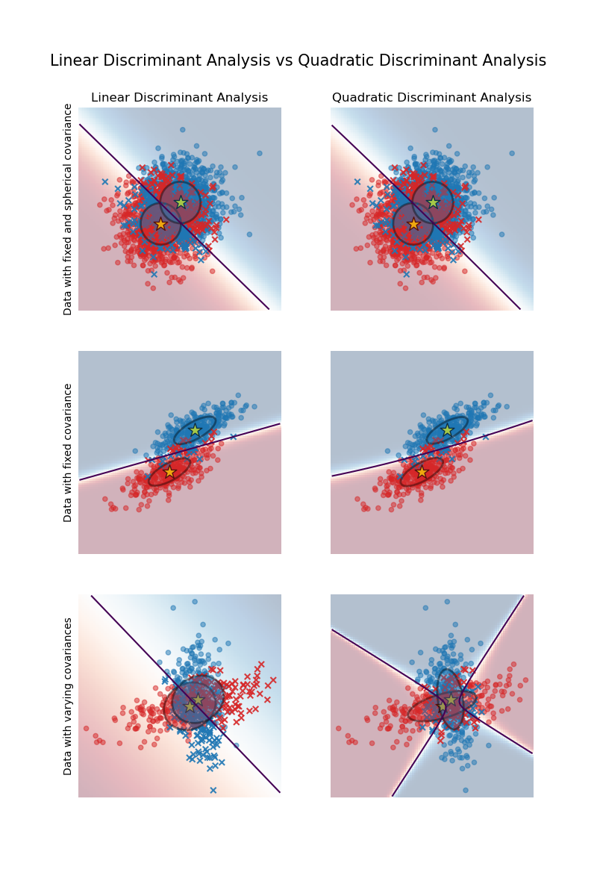
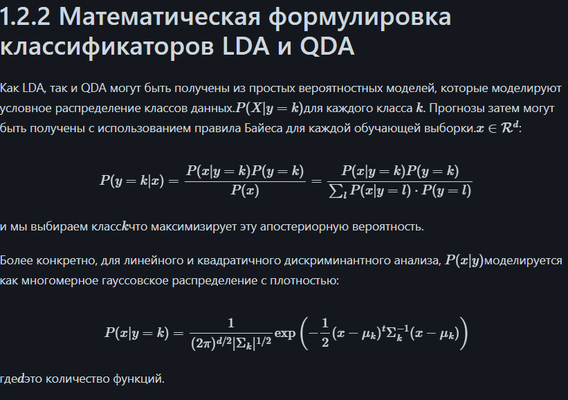
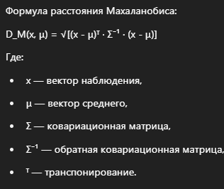
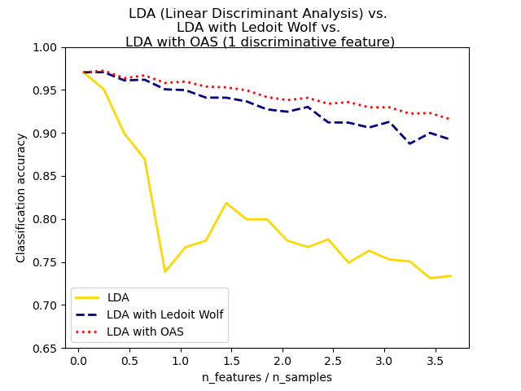

# Линейный и квадратичный дискриминантный анализ

# Уменьшение размерности с помощью линейного дискриминантного анализа

# PCA (Principal Component Analysis) — Анализ Главных Компонент

Метод снижения размерности данных. Шаги:

1. **Центрирование данных**  
   Вычитаем среднее значение из каждого признака.

2. **Ковариационная матрица**  
   Строим ковариационную матрицу признаков.

3. **Собственные векторы и значения**  
   Находим собственные векторы и соответствующие им собственные значения.

4. **Сортировка**  
   Сортируем собственные векторы по убыванию собственных значений.

5. **Проекция**  
   Выбираем топ-K компонент и проецируем данные на новое пространство меньшей размерности.

## Применение

- Визуализация данных  
- Уменьшение шума  
- Снижение размерности перед обучением моделей

