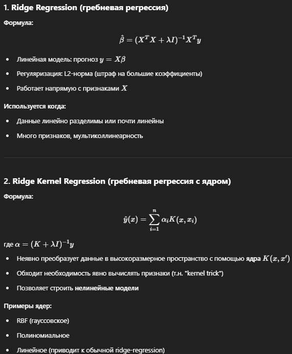
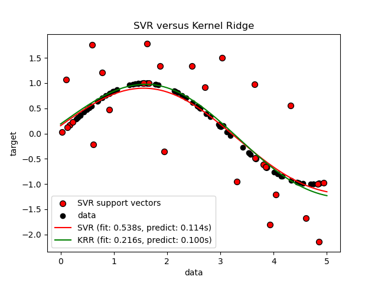
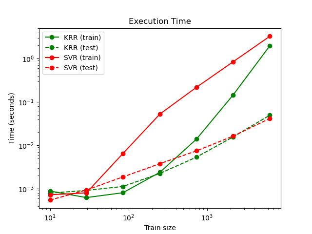

Методы ядра получили свое название благодаря использованию функций ядра , которые позволяют им работать в многомерном неявном пространстве признаков без вычисления координат данных в этом пространстве, а просто вычисляя внутренние произведения между изображениями всех пар данных в пространстве признаков. Эта операция часто оказывается вычислительно дешевле, чем явное вычисление координат. Такой подход называется « трюк ядра ».

[KRR обьяснение](https://www.geeksforgeeks.org/understanding-kernel-ridge-regression-with-sklearn/)

по сути тоже самое что и SVM, но оценщики разные. В KRR l1 используется, а в svm 
вроде квадратичный