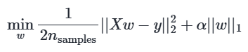
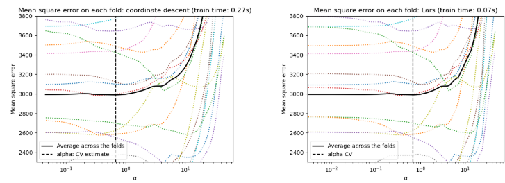
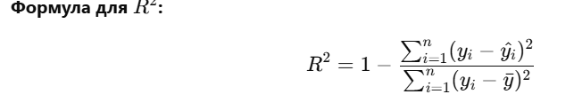
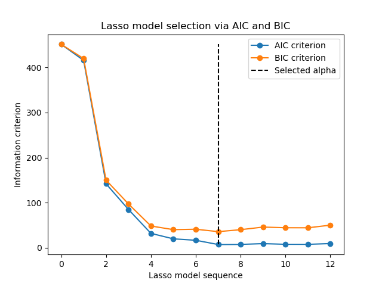
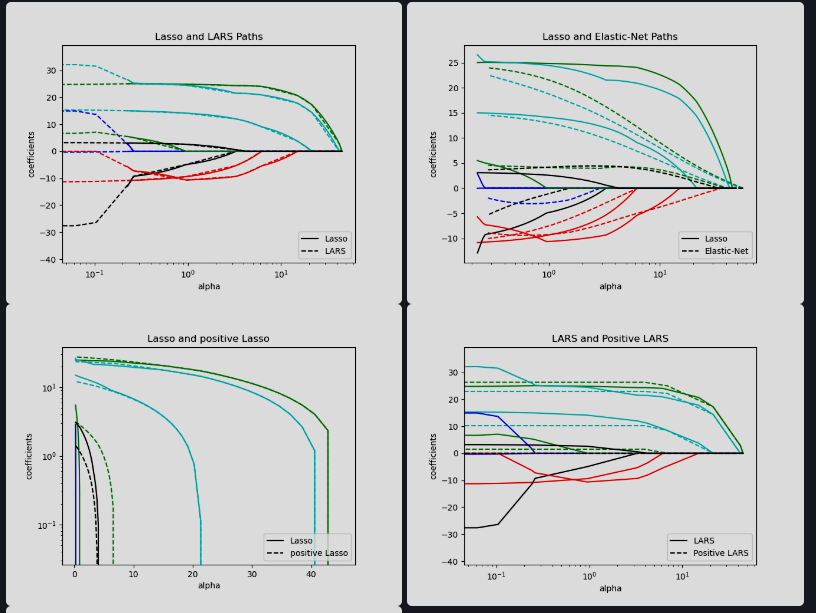

# L1 (Lasso) 



[Lasso Lars](https://scikit-learn.org/stable/modules/linear_model.html#least-angle-regression) работает быстрее на меньших наборах данных.



1. Разница между ошибкой на обучающих и тестовых данных:ы

    Если модель показывает низкую ошибку на обучающих данных (или высокую точность), но высокую ошибку на тестовых данных, это может свидетельствовать о переобучении.

    В идеале ошибка на тестовых данных должна быть примерно такой же, как и на обучающих, если модель не переобучена.

## Коэффециет детерминации


При кросс-валидации LassoCV мы автоматически ищем параметр $$alpha = a$$

# LassoLarsIC
[Выбор модели на основе информационных критериев](https://scikit-learn.org/stable/modules/linear_model.html#information-criteria-based-model-selection) тут написано про AIC (критерий информации акаине) и Байеса (BIC)


[Сравнение AIC-BIC / cross-validation](https://scikit-learn.org/stable/auto_examples/linear_model/plot_lasso_model_selection.html#sphx-glr-auto-examples-linear-model-plot-lasso-model-selection-py) Результаты почти одинаковые, лучше использовать AIC - более стабильный и быстрее (2d вместо log(N))

[Математические подробности](https://scikit-learn.org/stable/modules/linear_model.html#information-criteria-based-model-selection) выполняется вроде только при n_samples > n_features

Степени свободы (Degrees of Freedom, df) — это количество независимых данных или параметров, которые могут быть изменены, не нарушая ограничений в статистической модели.


Чем больше степеней свободы, тем точнее оценка статистического параметра

# SVM vs параметр регуляризации
[Сравнение с параметром регуляризации SVM ](https://scikit-learn.org/stable/modules/linear_model.html#comparison-with-the-regularization-parameter-of-svm)


```bash 
alpha = 1 / C # или 
alpha = 1 / (n_samples * C)
```

# Многозадачное Лассо

Ищет несколько целевых параметров одновременно, при этом используя схожие признаки для всех целевых параметров


При низких значениях alpha (слева):

1. Регуляризация слабая.

2. Почти все коэффициенты ненулевые (модель "верит" во все признаки).

При высоких значениях alpha (справа):

1. Регуляризация сильная.

2. Больше коэффициентов становится нулями → модель использует меньше признаков.

3. Это помогает сделать модель проще и избежать переобучения.

