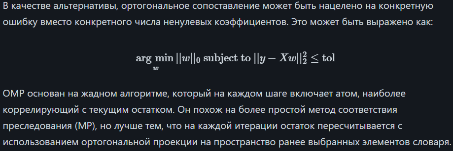

OMP для аппроксимации соответствия линейной модели с ограничениями, наложенными на количество ненулевых коэффициентов (т.е.
псевдонорма).

Коротко: OMP это про отбор признаков. Это задача сжимающего отбора признаков: "добиться наименьшей ошибки с минимумом признаков".

Формулировка с ограничением на ошибку:

🤔 В чём разница между ними?

| Формулировка | Что фиксируется                  | Что минимизируется         |
|--------------|----------------------------------|-----------------------------|
| №1           | Кол-во ненулевых коэффициентов   | Ошибка                      |
| №2           | Уровень ошибки                   | Кол-во признаков            |
