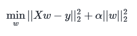
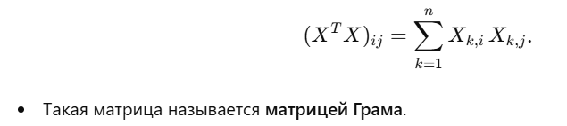

# Сравнение ridge vs least square

https://www.mit.edu/~9.520/spring07/Classes/rlsslides.pdf

Ridge формула

Ridge больше реагирует на Большие (и часто нестабильные) значения при коллинеарности и Ridge устраняет «раздутые» веса, уменьшая переобучение при высоко коррелированных признаках.

# Ridge Classifier

| **Контекст**            | **Зачем используется**                                                                 |
|-------------------------|---------------------------------------------------------------------------------------|
| Линейная регрессия      | Решение нормальных уравнений: $$\beta = (X^T X)^{-1} X^T y$$                           |
| Оценка коллинеарности   | Если $$X^T X$$ плохо обусловлена (близка к сингулярной), признаки сильно коррелированы |
| PCA / SVD               | Содержит ковариацию признаков (при центрировании данных)                               |

# Ridge Classifier Cross-Validation

## cross validation
A resampling method that iteratively partitions data into mutually exclusive ‘train’ and ‘test’ subsets so model performance can be evaluated on unseen data. This conserves data as avoids the need to hold out a ‘validation’ dataset and accounts for variability as multiple rounds of cross validation are generally performed. See User Guide for more details
