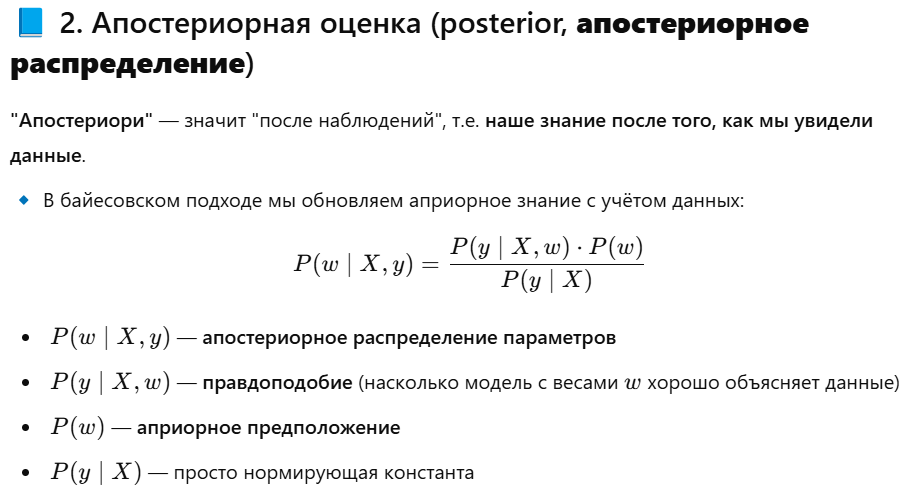
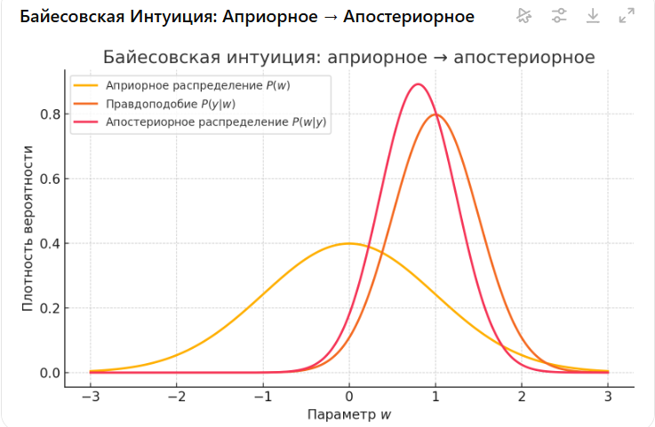
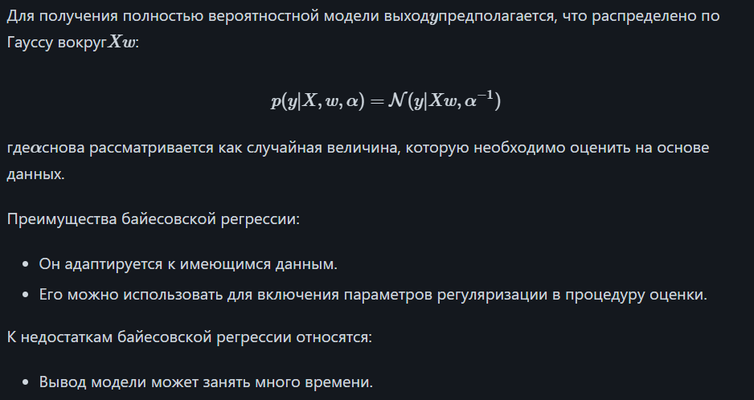
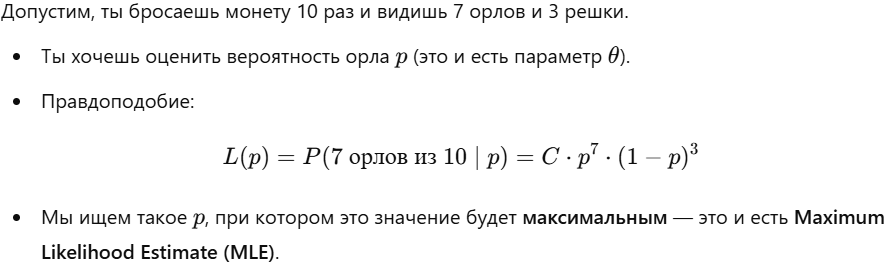
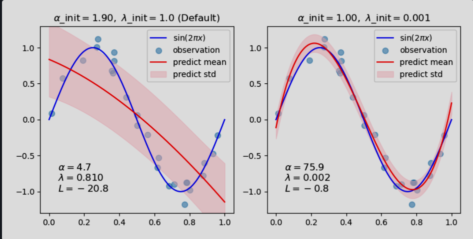
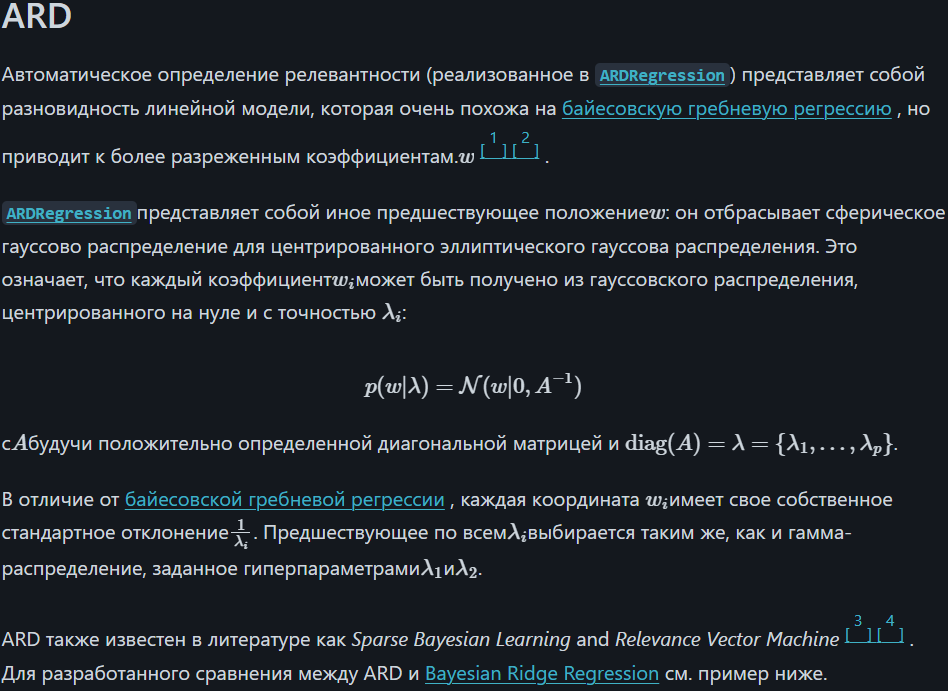
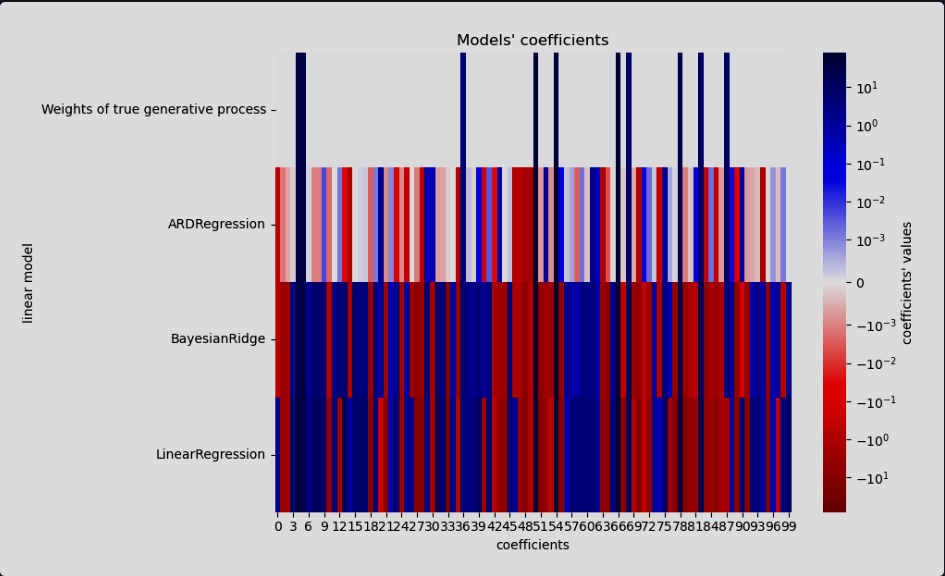
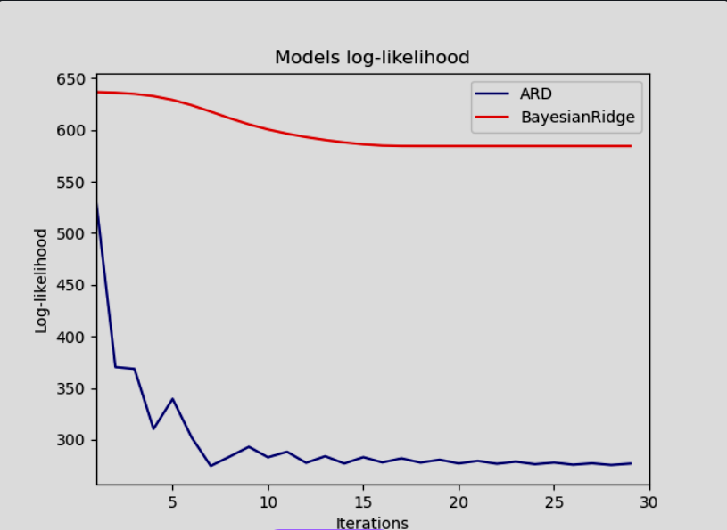
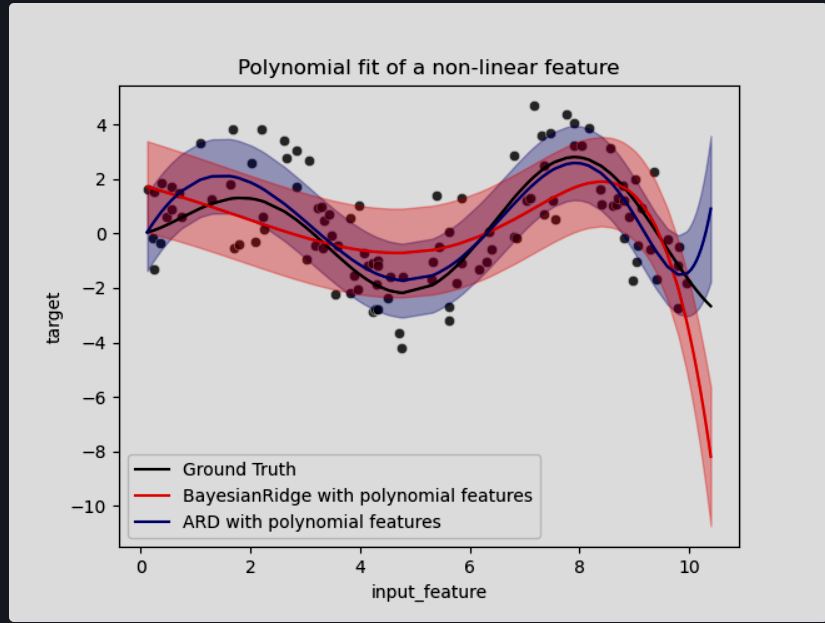

[Байесовская регрессия на sklearn](https://scikit-learn.org/stable/modules/linear_model.html#bayesian-regression)

Методы байесовской регрессии можно использовать для включения параметров регуляризации в процедуру оценки: параметр регуляризации не задается жестко, а настраивается на имеющиеся данные.

Априорное распределение данные:

Апостериорная оценка:

🧠 "неинформативные априорные данные":
1. Это априорные распределения, которые выражают отсутствие уверенности о значениях параметров (например, широкое или плоское распределение).

2. Используются, если ничего заранее не известно о весах модели.

Пример:

Правдоподобие — это мера того, насколько хорошо параметры модели объясняют наблюдаемые данные.

Maximum Likelihood Estimate (MLE)

 Предельное правдоподобие (marginal likelihood)

Правдоподобие и логарифмическое правдоподобие:

подгонка кривой с помощью Байесовской Ridge регрессии

ARD regression (автоматическое определение релевантности) - похоже на байесовскую гребневую, но веса получаются более разряженными

Comparing Linear Bayesian Regressors

Сранение RidgeBay and ARD 

Сравнение с полиномиальной
