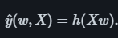
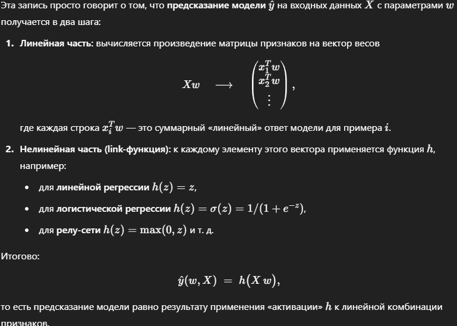
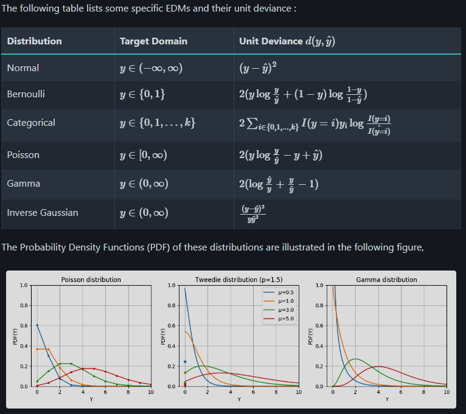
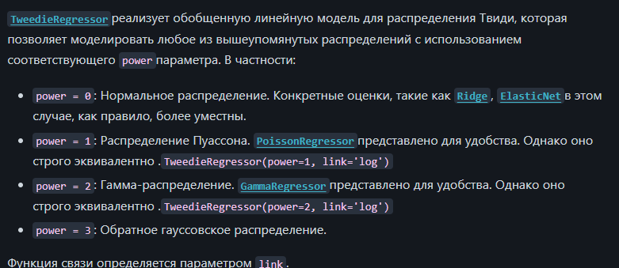
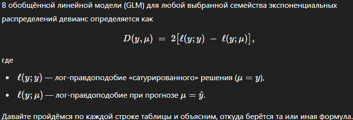
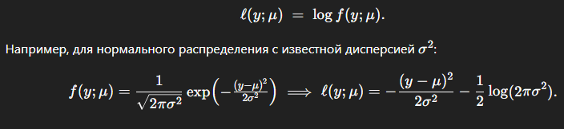
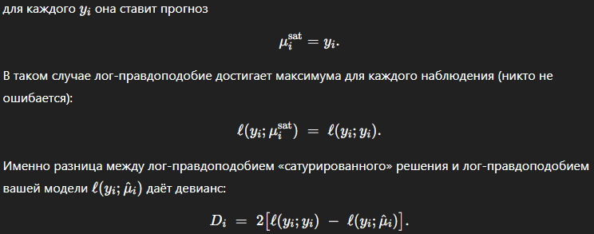

# Generalized Linear Models

# Обобщённая линейная регрессия (GLM)

В обобщённой линейной регрессии (GLM) вместо квадратичной потери

$$
(y_i - \hat y_i)^2
$$

используют так называемый **unit deviance** \(d(y_i,\hat y_i)\) для выбранного распределения из экспоненциального семейства.

---

## 1. Что такое девианс?

Для распределения из EDM (exponential dispersion model) девианс определяется как

$$
D(y, \mu) \;=\; 2\bigl[\ell(y; y) \;-\; \ell(y; \mu)\bigr],
$$

где

- \(\ell(y; \theta)\) — лог‑правдоподобие при «сатурированном» решении (то есть \(\mu=y\)),  
- \(\ell(y; \mu)\) — лог‑правдоподобие при модели, выдающей математическое ожидание \(\mu\).

**Unit deviance** \(d(y,\mu)\) — это вклад одного наблюдения в \(D\), то есть

$$
D = \sum_{i=1}^n d(y_i, \mu_i).
$$

---

## 2. Примеры unit deviance для разных семейств

1. **Нормальное (Gaussian)**  
   $$
   d(y,\mu) = (y - \mu)^2,
   $$
   — получается квадратичная потеря.

2. **Бернулли (Binomial, \(n=1\))**  
   $$
   d(y,\mu)
   = 2\Bigl[y\ln\frac{y}{\mu} + (1-y)\ln\frac{1-y}{1-\mu}\Bigr].
   $$
   При \(y\in\{0,1\}\) упрощается до
   $$
   -2\Bigl[y\ln\mu + (1-y)\ln(1-\mu)\Bigr].
   $$

3. **Пуассон (Poisson)**  
   $$
   d(y,\mu) = 2\Bigl[y\ln\frac{y}{\mu} - (y-\mu)\Bigr].
   $$

4. **Гамма (Gamma)**  
   $$
   d(y,\mu) = 2\Bigl[\frac{y-\mu}{\mu} - \ln\frac{y}{\mu}\Bigr].
   $$

---

## 3. Зачем это нужно?

- Квадратичная потеря лучшая, когда ошибки нормально распределены.  
- При другом распределении (дискретные счётчики, бинарные события, положительные непрерывные) правдоподобнее «натуральное» расстояние в терминах лог‑вероятности → unit deviance.  
- GLM минимизирует
  $$
    \frac{1}{2n}\sum_{i=1}^n d(y_i,\hat y_i)
    \;+\;
    \frac{\alpha}{2}\|w\|_2^2,
  $$
  что эквивалентно максимизации регуляризованного правдоподобия.

---

**Итог:** при переходе от линейной к обобщённой регрессии вы заменяете \((y-\hat y)^2\) на \(d(y,\hat y)\), где \(d\) зависит от выбранного распределения из экспоненциального семейства.

Лог правдоподобие, это логарифм от функции плотности вероятности f(y, q)

Сатурированное решение - это гипотетическая модель, которая "совершенно" подстраивается
под каждое наблюдение

