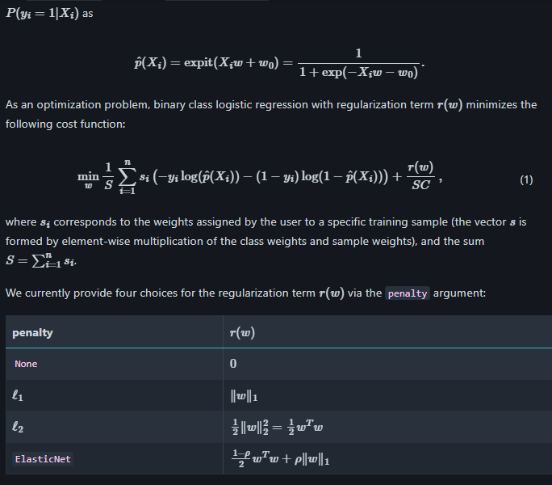
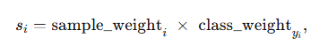
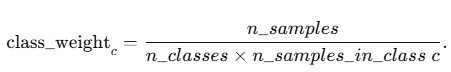

# [Binary Case](https://scikit-learn.org/stable/modules/linear_model.html#binary-case)



Обе величины не «учатся» моделью, а задаются извне:


```bash
class_weight = {0: 1.0, 1: 5.0} # можно, например,
    #  увеличить влияние ценных или редко встречающихся примеров.
sample_weights = np.array([1, 1, 5, 1, 10, …])  # len = n_samples
```

Можно задать class_weight



<b>Робастность</b> - свой-во алгоритма или модели сохранять качество работы при
    отклонениях от идеальных условий:

1. Шум и выбросы 
2. Смещение распределения
3. Небольшие изменения параметров

РОбастные функции потерь: 
    вместо квадратичной (чувствительность к большим ошибкам):
Huber-loss
quantile-loss
    Регуляризация
    data augmentation и преобразования (шум, сдвиги, искажения)
    ансамблирование ( bagging, random forest)