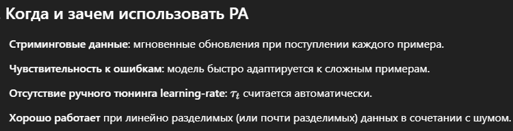
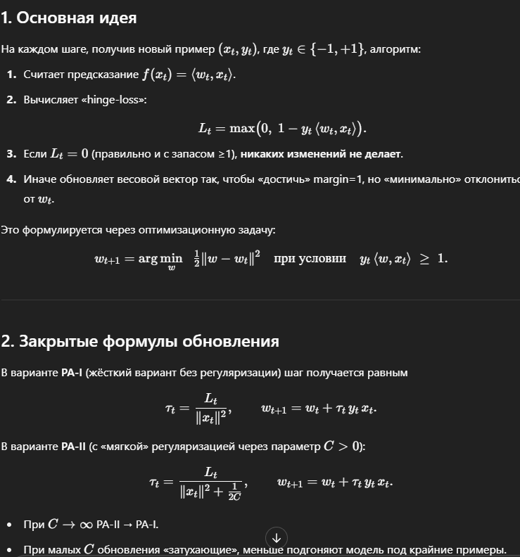

– OLS очень чувствителен к любым аномалиям;
– Theil–Sen и Huber хорошо работают при небольших нарушениях;
– RANSAC наиболее надёжен против крупных выбросов, но для этого требует гиперпараметра (доли inliers) и может давать менее гладкую аппроксимацию.