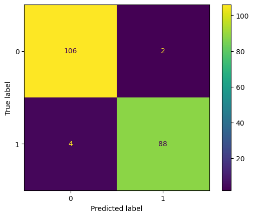

              precision    recall  f1-score   support

           0       0.96      0.98      0.97       108
           1       0.98      0.96      0.97        92

    accuracy                           0.97       200
   macro avg       0.97      0.97      0.97       200
weighted avg       0.97      0.97      0.97       200

Это вывод результатов классификации модели, обычно получаемый после оценки модели с использованием метрик **precision**, **recall**, **f1-score** и **support**. Рассмотрим каждую метрику:

### 1. **Precision (Точность)**:
   Precision измеряет, насколько хорошо модель находит **положительные** примеры среди тех, которые она предсказала как положительные.

   Формула для точности:
   \[
   \text{Precision} = \frac{\text{True Positives}}{\text{True Positives} + \text{False Positives}}
   \]
   - Для класса 0: **0.96** (т.е., 96% из предсказанных как класс 0 на самом деле являются классом 0).
   - Для класса 1: **0.98** (т.е., 98% из предсказанных как класс 1 на самом деле являются классом 1).

### 2. **Recall (Полнота)**:
   Recall измеряет, насколько хорошо модель находит **все** возможные положительные примеры.

   Формула для полноты:
   \[
   \text{Recall} = \frac{\text{True Positives}}{\text{True Positives} + \text{False Negatives}}
   \]
   - Для класса 0: **0.98** (т.е., 98% реальных примеров класса 0 модель правильно классифицирует как класс 0).
   - Для класса 1: **0.96** (т.е., 96% реальных примеров класса 1 модель правильно классифицирует как класс 1).

### 3. **F1-score (F1-мерa)**:
   F1-мерa — это гармоническое среднее между **precision** и **recall**. Она учитывает как ложные положительные, так и ложные отрицательные ошибки.

   Формула для F1:
   \[
   F1 = 2 \times \frac{\text{Precision} \times \text{Recall}}{\text{Precision} + \text{Recall}}
   \]
   - Для класса 0: **0.97**.
   - Для класса 1: **0.97**.

### 4. **Support**:
   Support — это количество реальных примеров каждого класса в тестовом наборе данных:
   - Для класса 0: **108** примеров.
   - Для класса 1: **92** примера.

### 5. **Accuracy (Точность)**:
   Общая точность модели — это доля правильно классифицированных примеров из всех:

   \[
   \text{Accuracy} = \frac{\text{True Positives} + \text{True Negatives}}{\text{Total Samples}}
   \]
   В вашем случае точность модели: **0.97** или **97%**.

### 6. **Macro Average**:
   Это среднее значение всех метрик (**precision**, **recall**, **f1-score**) по классам, не учитывая их частоту. Все классы учитываются одинаково, независимо от их количества.

   - **Macro avg precision**: 0.97  
   - **Macro avg recall**: 0.97  
   - **Macro avg f1-score**: 0.97

### 7. **Weighted Average**:
   Это среднее значение метрик, взвешенное с учётом числа примеров в каждом классе. Классы с большим количеством примеров оказывают большее влияние на итоговую метрику.

   - **Weighted avg precision**: 0.97  
   - **Weighted avg recall**: 0.97  
   - **Weighted avg f1-score**: 0.97

---

### Заключение
- Модель показывает **очень хорошие результаты**: высокая точность, полнота и F1-меры для обоих классов.
- Точность (accuracy) составляет **97%**, что является отличным показателем для большинства задач классификации.
- **F1-score** для обоих классов равен **0.97**, что означает хороший баланс между точностью и полнотой.
